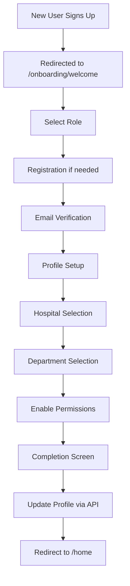

# Onboarding Flow Integration

## Overview

The onboarding flow has been integrated into the main app to provide a seamless experience for new users. The flow guides users through profile setup, role selection, and organization/hospital assignment.

## Integration Points

### 1. **Entry Point (`app/index.tsx`)**
- New users are automatically redirected to `/onboarding/welcome`
- Detection logic:
  ```typescript
  if (!user.emailVerified || user.needsProfileCompletion === true || user.role === 'user' || !user.role || user.role === 'guest') {
    return <Redirect href="/onboarding/welcome" />;
  }
  ```

### 2. **Onboarding Screens**
Located in `app/onboarding/`:
- `welcome.tsx` - Introduction screen
- `role-selection.tsx` - Choose healthcare role
- `registration.tsx` - Create account (if not already logged in)
- `email-verification.tsx` - Verify email with OTP
- `profile-setup.tsx` - Professional details
- `hospital-setup.tsx` - Select hospital
- `department-setup.tsx` - Choose department
- `permissions.tsx` - Enable app features
- `completion.tsx` - Success screen

### 3. **Profile Completion API**
The completion screen calls `api.auth.completeProfile` to:
- Update user profile in the database
- Set `needsProfileCompletion` to false
- Assign organization and hospital
- Update the auth session

### 4. **State Management**
- **Onboarding State**: Managed by `useOnboardingFlow` hook
- **Persistence**: AsyncStorage saves progress
- **Auth State**: Updated via `useAuth` hook after completion

## User Flow



## Testing the Integration

### Manual Testing
1. **New User Flow**:
   ```bash
   # Clear app data
   # Sign up with new email
   # Should redirect to onboarding
   ```

2. **Existing User with Incomplete Profile**:
   ```bash
   # Login with user that has needsProfileCompletion = true
   # Should redirect to onboarding
   ```

### Test Script
Run the integration test script:
```bash
npx tsx scripts/test-onboarding-flow.ts
```

## Key Features

### 1. **Progress Tracking**
- Progress bar shows completion status
- State persists across app restarts
- Users can go back to previous steps

### 2. **Role-Based Flow**
- Different paths for healthcare vs non-healthcare roles
- License verification for medical professionals
- Department selection for hospital staff

### 3. **Validation**
- Email verification via OTP
- Required fields validation
- License number format checking

### 4. **Graceful Handling**
- Skip options for non-critical steps
- Error recovery
- Clear error messages

## Configuration

### Required Environment Variables
None - the onboarding flow uses the existing app configuration.

### Customization Points
1. **Onboarding Steps** - Edit `modules/onboarding/utils/constants.ts`
2. **Role Options** - Modify `ROLE_OPTIONS` in constants
3. **Hospital/Department Lists** - Currently mocked, integrate with real API
4. **Styling** - Uses app's design system tokens

## Troubleshooting

### Common Issues

1. **User stuck in redirect loop**
   - Check `needsProfileCompletion` flag in database
   - Verify `emailVerified` status
   - Clear AsyncStorage onboarding data

2. **Profile completion fails**
   - Check API logs for validation errors
   - Ensure all required fields are provided
   - Verify organization/hospital IDs are valid

3. **Progress not saving**
   - Check AsyncStorage permissions
   - Verify `ONBOARDING_STORAGE_KEY` is unique
   - Look for storage quota issues

### Debug Commands
```typescript
// Check onboarding state
AsyncStorage.getItem('onboarding_state').then(console.log)

// Reset onboarding
AsyncStorage.removeItem('onboarding_state')

// Check user flags
console.log(user.needsProfileCompletion, user.emailVerified)
```

## Future Enhancements

1. **Analytics Integration**
   - Track drop-off points
   - Measure completion time
   - A/B test different flows

2. **Dynamic Content**
   - Organization-specific onboarding
   - Role-based tutorials
   - Personalized welcome messages

3. **Advanced Features**
   - Team invitations during onboarding
   - Shift preference setup
   - Training module integration

## Maintenance

- Keep onboarding content up-to-date
- Review and update role options periodically
- Monitor completion rates
- Gather user feedback for improvements