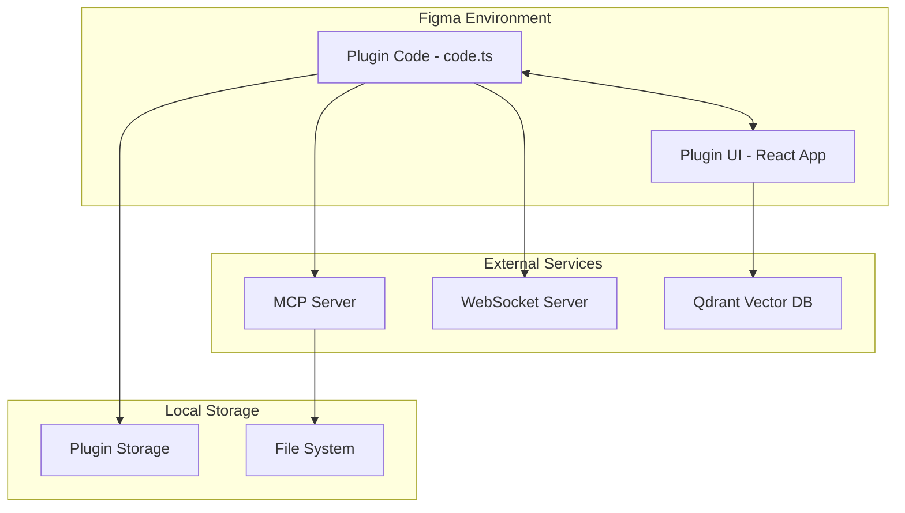
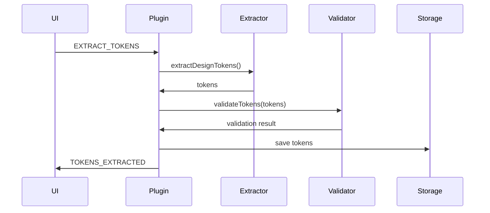
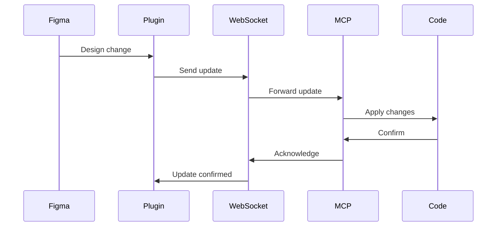

# 🏗 Architecture Overview

Comprehensive technical architecture of the Figma Universal Design System Plugin.

## 🎯 System Overview

The plugin follows a modular, event-driven architecture with clear separation between the Figma plugin runtime, UI layer, and external services.



## 🔧 Core Components

### 1. Plugin Runtime (`src/code.ts`)
The main plugin code that runs in Figma's JavaScript environment:

- **Responsibilities**:
  - Figma API interactions
  - Node manipulation
  - Style and variable management
  - Message handling from UI

- **Key Features**:
  - ES5-compatible code (transpiled)
  - Async operations with proper error handling
  - Operation queue with pause/resume
  - State persistence

### 2. UI Layer (`src/ui/`)
React-based UI running in an iframe:

- **Stack**:
  - React 18 with TypeScript
  - TanStack Router for navigation
  - Zustand for state management
  - Tailwind CSS for styling

- **Architecture**:
  ```
  ui/
  ├── routes/          # Page components
  ├── components/      # Reusable components
  ├── stores/          # Zustand stores
  ├── lib/             # Utilities
  └── styles/          # Global styles
  ```

### 3. Handler Layer (`src/handlers/`)
Business logic handlers that process operations:

- **Token Handlers**:
  - `token-extractor.ts` - Extract design tokens
  - `token-applier.ts` - Apply tokens to Figma
  - `token-validator.ts` - Validate token integrity

- **Generation Handlers**:
  - `component-library-generator.ts` - Generate component code
  - `design-documentation-exporter.ts` - Export documentation
  - `code-generator.ts` - Generate framework-specific code

- **Sync Handlers**:
  - `mcp-sync.ts` - MCP protocol synchronization
  - `websocket-client.ts` - Real-time sync

### 4. Service Layer (`src/services/`)
External service integrations:

- **Embeddings Service**:
  ```typescript
  interface EmbeddingsService {
    generateEmbedding(text: string): Promise<number[]>;
    searchSimilar(embedding: number[], limit: number): Promise<SearchResult[]>;
  }
  ```

- **Memory Service**:
  - Document indexing
  - Semantic search
  - Code pattern matching

### 5. Library Layer (`src/lib/`)
Core utilities and managers:

- **Operation Queue**:
  ```typescript
  class OperationQueue {
    add(operation: Operation): string;
    pause(operationId: string): void;
    resume(operationId: string): void;
    cancel(operationId: string): void;
  }
  ```

- **Sync State Manager**:
  ```typescript
  class SyncStateManager {
    saveCheckpoint(state: SyncState): void;
    restoreCheckpoint(checkpointId: string): SyncState;
    resolveConflict(local: any, remote: any): any;
  }
  ```

- **WebSocket Manager**:
  - Automatic reconnection
  - Message queuing
  - Conflict resolution

## 📊 Data Flow

### Token Extraction Flow


### Real-time Sync Flow


## 🔒 Security Architecture

### Plugin Security
- Sandboxed execution environment
- Limited file system access
- Network access via allowed domains only

### Data Security
- No sensitive data in plugin storage
- Encrypted WebSocket connections
- Token-based authentication for services

### Code Security
- Input validation on all handlers
- XSS prevention in UI
- CSRF protection for API calls

## 🚀 Performance Optimizations

### Batching Operations
```typescript
class BatchProcessor {
  private queue: Operation[] = [];
  private timer: NodeJS.Timeout;
  
  add(operation: Operation) {
    this.queue.push(operation);
    this.scheduleBatch();
  }
  
  private async processBatch() {
    const batch = this.queue.splice(0, BATCH_SIZE);
    await Promise.all(batch.map(op => op.execute()));
  }
}
```

### Caching Strategy
- In-memory cache for frequently accessed data
- Persistent cache for design tokens
- Cache invalidation on design changes

### Lazy Loading
- Route-based code splitting
- Dynamic imports for heavy operations
- Progressive enhancement

## 🔄 State Management

### Plugin State
```typescript
interface PluginState {
  tokens: DesignTokens;
  operations: Operation[];
  syncStatus: SyncStatus;
  settings: PluginSettings;
}
```

### UI State (Zustand)
```typescript
interface UIState {
  // Navigation
  activeTab: string;
  
  // Operations
  operations: Operation[];
  selectedOperation: string | null;
  
  // UI State
  isLoading: boolean;
  error: Error | null;
  
  // Actions
  setActiveTab: (tab: string) => void;
  addOperation: (op: Operation) => void;
}
```

## 🧪 Testing Architecture

### Unit Tests
- Handler logic testing
- Utility function testing
- Component testing

### Integration Tests
- API integration testing
- Service communication testing
- End-to-end workflows

### Test Structure
```
tests/
├── unit/
│   ├── handlers/
│   ├── utils/
│   └── components/
├── integration/
│   ├── api/
│   └── services/
└── e2e/
    └── workflows/
```

## 📦 Build System

### Development Build
```bash
# Watches and rebuilds on changes
npm run dev

# Runs:
# - Vite for UI (HMR enabled)
# - Bun for plugin code
# - TypeScript compiler in watch mode
```

### Production Build
```bash
# Optimized production build
npm run build

# Steps:
# 1. TypeScript compilation
# 2. Bundle with Bun
# 3. Transpile to ES5 for Figma
# 4. Minify and optimize
# 5. Generate source maps
```

## 🔌 Extension Points

### Adding New Handlers
1. Create handler in `src/handlers/`
2. Add message type to `MessageType` enum
3. Register in `code.ts` message handler
4. Add UI trigger in appropriate route

### Adding New Services
1. Define service interface
2. Implement service class
3. Register in dependency injection
4. Add to plugin initialization

### Custom Extractors
```typescript
interface TokenExtractor<T> {
  name: string;
  extract(node: SceneNode): T[];
  validate(tokens: T[]): ValidationResult;
  transform(tokens: T[]): any;
}
```

## 📈 Monitoring & Logging

### Logging Strategy
- Structured logging with levels
- Operation tracking with IDs
- Performance metrics collection

### Error Handling
```typescript
try {
  await operation.execute();
} catch (error) {
  logger.error('Operation failed', {
    operationId: operation.id,
    error: error.message,
    stack: error.stack
  });
  
  // Notify UI
  figma.ui.postMessage({
    type: MessageType.OPERATION_FAILED,
    data: { operationId: operation.id, error }
  });
}
```

## 🔗 Related Documentation

- [Plugin Development Guide](../guides/plugin-development.md)
- [API Reference](../api/README.md)
- [Security Best Practices](../guides/security.md)
- [Performance Tuning](../guides/performance.md)